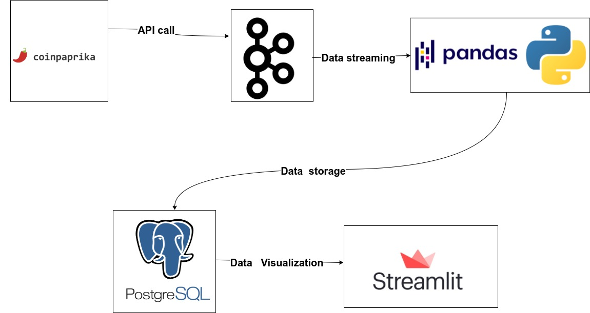
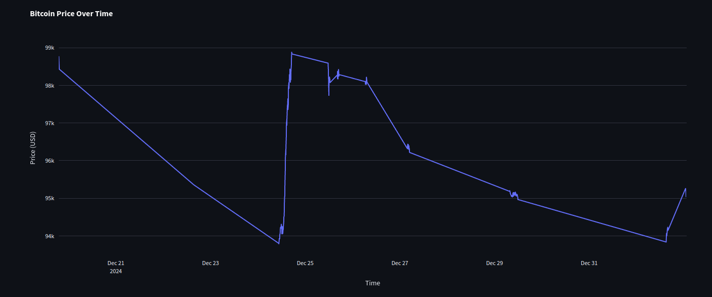
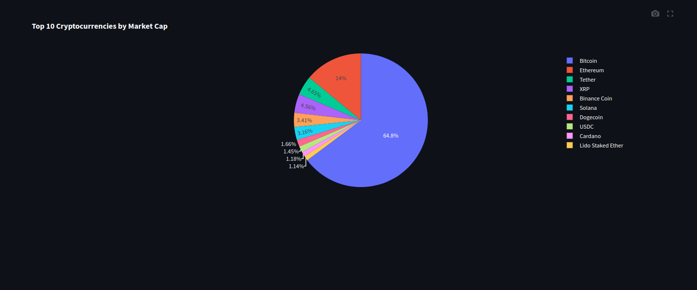
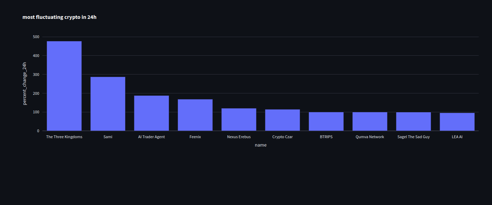

# Cryptocurrency Data Pipeline


## Architecture 


Pipeline Consists of various modules:

 - **Coinpaprika API Wrapper**: Fetches real-time cryptocurrency data.
 - **Kafka**: Handles real-time data streaming.
 - **Pandas**: For data transformation.
 - **PostgreSQL Database**: Stores processed cryptocurrency data.
 - **Streamlit Dashboard**: Provides interactive visualizations of cryptocurrency trends.

---

## Overview
The pipeline captures real-time data from the [Coinpaprika API](https://coinpaprika.com/), processes it using Kafka, and stores it in a PostgreSQL database for persistence. The data is then visualized through an interactive dashboard built with Streamlit. This setup is ideal for monitoring cryptocurrency trends in real-time.

---

### ETL Flow

1. **Data Extraction**:
   - Real-time cryptocurrency data is fetched from the Coinpaprika API.
   - This includes key metrics like prices, volume, and market cap.

2. **Real-Time Streaming**:
   - Kafka handles the streaming of cryptocurrency data to ensure low-latency data ingestion.

3. **Data Transformation**:
   - The streaming data is transformed using pandas before being stored in PostgreSQL.

4. **Data Storage**:
   - The PostgreSQL database organizes and stores cryptocurrency data, allowing for efficient querying.

5. **Visualization**:
   - A Streamlit dashboard fetches data from the PostgreSQL database and visualizes trends like price changes, market cap rankings, and more.

---


## Environment Setup

### Prerequisites
- Python 3.9 or above
- Kafka (locally or via cloud services)
- PostgreSQL database
- Streamlit installed (`pip install streamlit`)

### Installing Dependencies
```bash
pip install -r requirements.txt
```
# Output
## Dashboard





